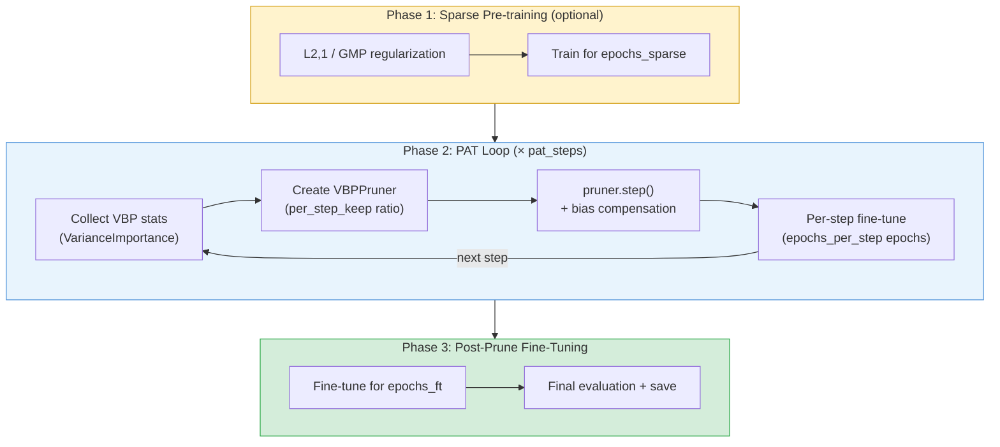
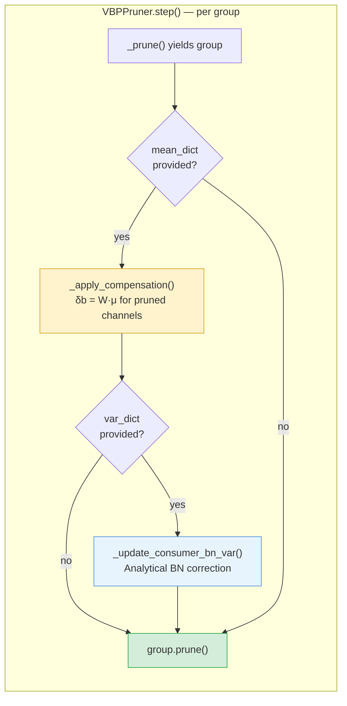

# SIRC Torch-Pruning v2 (STP v2) — Internal Technical Document

> **Audience:** SIRC team
> **Repo:** [`sirc-torch-pruning`](https://github.com/AvrahamRaviv/sirc-torch-pruning.git) on `master`
> **Upstream:** [Torch-Pruning v1.6.1](https://github.com/VainF/Torch-Pruning) by Gongfan Fang
> **Paper:** [DepGraph (2301.12900)](https://arxiv.org/abs/2301.12900), [VBP (2507.12988)](https://arxiv.org/abs/2507.12988)

---

## 1. High-Level Design

### 1.1 TP Core Architecture

Torch-Pruning is built on four abstractions:

| Abstraction | Role | Key file |
|---|---|---|
| **DependencyGraph (DG)** | Traces a model with dummy inputs, builds a dependency graph, and yields *pruning groups* — sets of layers whose channels are coupled and must be pruned together. | `torch_pruning/dependency/graph.py` |
| **Importance** | Callable that scores channels within a group: `__call__(group) -> 1-D tensor`. Implementations: Magnitude, Taylor, Hessian, BNScale, LAMP, Random, MACAwere, Variance. | `torch_pruning/pruner/importance.py` |
| **BasePruner** | Orchestrates the pruning loop: `step()` → `_prune()` → iterate groups → compute importance → apply scope/threshold → `group.prune()`. Handles local/global ranking, iterative schedules, ignored layers, attention heads. | `torch_pruning/pruner/algorithms/base_pruner.py` |
| **Group** | A list of `(Dependency, indices)` pairs representing coupled layers (e.g., Conv → BN → next Conv input channels). `group.prune()` applies the structural modification atomically. | `torch_pruning/dependency/graph.py` |


**Key detail:** `_prune()` is a *generator*. It yields groups one at a time, allowing `VBPPruner.step()` to apply bias compensation *before* calling `group.prune()` on each group.

### 1.2 PAT Pipeline

The benchmark script (`benchmarks/vbp/vbp_imagenet.py`) wraps the pruner in a three-phase pipeline:

1. **Sparse Pre-training** *(optional)* — L2,1 group regularization or GMP (Gradual Magnitude Pruning) to induce structured sparsity before pruning.
2. **Iterative PAT Loop** — `pat_steps` iterations of: collect VBP stats → create pruner → `pruner.step()` → per-step fine-tune.
3. **Post-Prune Fine-Tuning** — Standard training to recover accuracy after all pruning steps.

**Geometric schedule:** each step keeps `per_step_keep = keep_ratio^(1/N)` channels, so after N steps the cumulative ratio equals the target.

**One-shot** = special case with `pat_steps=1`, `pat_epochs_per_step=0`, `epochs_ft=N`.



---

## 2. STP v2 Improvements

### 2.1 Rebase to TP v1.6.1

Previously on v1.5.1. We rebased onto upstream:

| Commit | What it brings |
|---|---|
| `2924e26` — V1.6.0 | Refactored dependency module: cleaner Node / Group / DG separation, improved isomorphic + MHA pruning support |
| `e80127d` — v1.6.1 | Code style cleanup |
| `a878886` | Internal version bumped to **2.0.0** for our fork |

### 2.2 Pruning Utils Cleanup

10 commits (`21a4bdf` → `cba9bf4`) modernizing `torch_pruning/utils/pruning_utils.py`:

- **PEP 8 class names:** `channel_pruning` → `ChannelPruning`, `slice_pruning` → `SlicePruning`
- **`PruningMethod` enum** replacing magic strings for pruning types
- **`_log()` helper** eliminating ~15 duplicate if-else logging blocks
- **Linear + LayerNorm support** for transformers (`ab3e27f`)
- **Bug fixes:**
  - `ignored_layers` accumulation bug in `set_layers_to_prune()` (`e3a381f`)
  - Hardcoded `'cuda'` device in `SlicePruning.regularize()` (`1022317`)
- **Unit tests** added (`cba9bf4`)

### 2.3 New Importance Criteria

#### MACAwareImportance (`6f389ba`)

Wraps any base importance (default: L2 magnitude) and scales scores by per-layer MAC cost, encouraging pruning of computationally expensive layers first.

```
score = alpha * norm(base_imp) + (1 - alpha) * (mac_ratio ^ beta)    # "Sum" mode
score = base_imp * (mac_ratio ^ beta)                                 # "Mul" mode
```

Key parameters: `alpha` (importance vs MAC trade-off), `beta` (MAC exponent).

#### VarianceImportance (`f8526fd`)

Post-activation variance as channel importance (VBP paper, arXiv 2507.12988). Collects exact statistics (no EMA) via forward hooks:

1. Register hooks on target layers → accumulate `sum(x)`, `sum(x^2)`, `count`
2. Compute `variance = E[x^2] - E[x]^2` per channel
3. During pruning: low-variance channels are pruned first

**`target_layers` parameter** enables architecture-specific hooking:
- **ViT:** `[(fc1, gelu_fn), ...]` — post-GELU stats on MLP intermediate layers
- **CNN:** Auto-detected via `build_cnn_target_layers(model, DG)` — walks the DG to find Conv → BN → activation chains and composes `post_act_fn`

#### CNN Auto-Detection Helpers

| Helper | Purpose |
|---|---|
| `build_cnn_target_layers(model, DG)` | Walk DG from each Conv2d → find BN + activation → compose into `post_act_fn` |
| `build_cnn_ignored_layers(model, arch)` | Build ignored layers for ResNet (stem, conv3, downsamples) or MobileNetV2 (stem, classifier, project/DW convs) |

### 2.4 VBP Integration

40+ commits (`f8526fd` → `e25177f`) adding Variance-Based Pruning with full pipeline support.

#### VBPPruner (`torch_pruning/pruner/algorithms/vbp_pruner.py`)

Extends `BasePruner` with three post-prune corrections applied *per group before* `group.prune()`:

1. **Bias compensation** — For each pruned channel, compute `delta_b = W[:, pruned] @ mu[pruned]` and add to consumer's bias. Handles Linear, Conv2d, and depthwise Conv2d consumers.
2. **BN variance update** — Analytically corrects `running_var` of downstream BatchNorm using stored activation variances, avoiding the need for full recalibration.
3. **Mean-check diagnostics** *(optional)* — Forward hooks measure per-channel mean shift before/after compensation for validation.



#### CNN Support

Tested architectures: **ResNet-50**, **MobileNetV2**.

Key challenges solved:
- **BN recalibration:** Must call `reset_running_stats()` before recalibrating — stale stats from the original model otherwise persist → 0% accuracy
- **DW conv group root:** In MobileNetV2, DW conv is the group root but stats are on the expand conv. `_apply_compensation` searches the group for a module with matching-size means
- **DW conv + `ignored_layers`:** DW convs must NOT be in `ignored_layers` — they appear in expand conv groups with `out_channel` pruning, causing group rejection
- **`nn.ReLU6` mapping:** `ReLU6` uses `HardtanhBackward0` internally — mapped `"hardtanh"` → `relu6` in activation detection

#### PAT Pipeline Features

- **DDP support** via `torchrun` with proper stat synchronization across ranks
- **Knowledge distillation** (optional `--use_kd`) with soft cross-entropy loss
- **Variance entropy loss** (optional `--var_loss_weight`) as auxiliary regularization
- **Sparse pre-training** modes: `l1_group` (L2,1), `gmp` (Gradual Magnitude Pruning)
- **Sweep mode**: Collect stats once, then test multiple keep ratios via `deepcopy` + `remap_importance()`

---

## 3. Key Source Files

| File | Description |
|---|---|
| `torch_pruning/dependency/graph.py` | DependencyGraph: `build_dependency()`, `get_all_groups()` |
| `torch_pruning/pruner/algorithms/base_pruner.py` | BasePruner: `step()`, `_prune()` generator, scope/threshold logic |
| `torch_pruning/pruner/algorithms/vbp_pruner.py` | VBPPruner: bias compensation, BN variance update |
| `torch_pruning/pruner/importance.py` | All importance criteria + `build_cnn_target_layers/ignored_layers` |
| `torch_pruning/utils/pruning_utils.py` | `ChannelPruning`, `SlicePruning`, `PruningMethod` enum |
| `benchmarks/vbp/vbp_imagenet.py` | Full PAT pipeline: sparse → PAT → FT, DDP, KD |
| `benchmarks/vbp/sparse_utils.py` | `l21_regularization()`, `gmp_sparsity_schedule()`, `apply_unstructured_pruning()` |
| `benchmarks/vbp/vbp_imagenet_pat.py` | Thin PAT demo via Pruning class |
| `benchmarks/vbp/plot_results.py` | Log parser, comparison against paper Table 10 |
